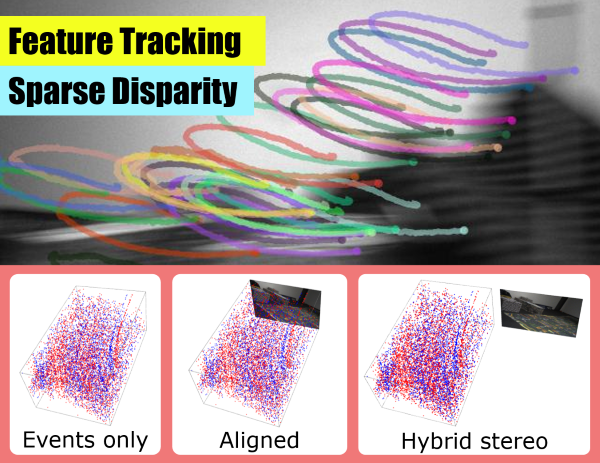

# Data-driven Feature Tracking for Event Cameras with and without Frames

<p align="center">
  
</p>

This is the code for the T-PAMI 2025 paper **Data-driven Feature Tracking for Event Cameras with and without Frames**
([PDF](https://rpg.ifi.uzh.ch/docs/Arxiv24_Messikommer.pdf)) by [Nico Messikommer](https://messikommernico.github.io/), [Carter Fang](https://ctyfang.github.io/), [Mathis Gehrig](https://magehrig.github.io/), [Giovanni Cioffi](https://giovanni-cioffi.netlify.app/), and [Davide Scaramuzza](http://rpg.ifi.uzh.ch/people_scaramuzza.html).

This subdirectory `disp_training/` represents a separate code base for the disparity estimation method presented in the T-PAMI 2025 paper **Data-driven Feature Tracking for Event Cameras with and without Frames**.
This code is independent of the code base used in the CVPR23 paper "Data-driven Feature Tracking for Event Cameras" located in the parent directory.

If you use any of this code, please cite the following publication:

```bibtex
@Article{Messikommer25tpami,
  author  = {Nico Messikommer and Carter Fang and Mathias Gehrig and Giovanni Cioffi and Davide Scaramuzza},
  title   = {Data-driven Feature Tracking for Event Cameras with and without Frames},
  journal = {{IEEE} Trans. Pattern Anal. Mach. Intell. (T-PAMI)},
  year    = {2025},
}
```

## Abstract

Because of their high temporal resolution, increased resilience to motion blur, and very sparse output, event cameras have 
been shown to be ideal for low-latency and low-bandwidth feature tracking, even in challenging scenarios. Existing feature tracking
methods for event cameras are either handcrafted or derived from first principles but require extensive parameter tuning, are sensitive
to noise, and do not generalize to different scenarios due to unmodeled effects. To tackle these deficiencies, we introduce the first
data-driven feature tracker for event cameras, which leverages low-latency events to track features detected in an intensity frame. We
achieve robust performance via a novel frame attention module, which shares information across feature tracks. Our tracker is
designed to operate in two distinct configurations: solely with events or in a hybrid mode incorporating both events and frames. The
hybrid model offers two setups: an aligned configuration where the event and frame cameras share the same viewpoint, and a hybrid
stereo configuration where the event camera and the standard camera are positioned side-by-side. This side-by-side arrangement is
particularly valuable as it provides depth information for each feature track, enhancing its utility in applications such as visual odometry
and simultaneous localization and mapping.

---

## Content

This document describes the usage and installation for the sparse disparity method.<br>

1. [Installation](#Installation)<br>
2. [Pretrained Weights](#Pretrained-Weights)<br>
3. [Preparing Disparity Data](#Preparing-Disparity-Data)<br>
4. [Training](#Training)<br>
5. [Evaluation](#Evaluation)<br>

---

## Installation

The following code uses Python 3.9.7<br>
All the files referenced below are located in the directory `disp_training/` to avoid compatibility problems with the event tracker published in the CVPR23 paper "Data-driven Feature Tracking for Event Cameras" paper.<br> 

1. If desired, a conda environment can be created using the following command:

```bash
conda create -n <env_name>
```

2.  Install the dependencies via the requirements.txt file<br>

    Dependencies for training:
    <ul>
        <li>PyTorch</li>
        <li>Torch Lightning</li>
        <li>Hydra</li>
    </ul><br>
    
    Dependencies for pre-processing:
    <ul>
        <li>numpy</li>
        <li>OpenCV</li>
        <li>H5Py and HDF5Plugin</li>
    </ul><br>
    
    Dependencies for visualization:
    <ul>
        <li>matplotlib</li>
        <li>seaborn</li>
        <li>imageio</li>
    </ul><br>
---

## Pretrained Weights

We provide the [network weights](https://download.ifi.uzh.ch/rpg/CVPR23_deep_ev_tracker/disp_pretrained_weights.ckpt) trained on the M3ED dataset


---

## Preparing Disparity Data

### Download M3ED Dataset

Download link [M3ED](https://m3ed.io/download/)

To generate the ground truth disparity and feature tracks for the M3ED dataset, we need the `<sequence>_data.h5` and `<sequence>_depth_gt.h5` files.  

If you use the M3ED dataset in an academic context, please cite:

```bibtex
@InProceedings{Chaney_2023_CVPR,
    author    = {Chaney, Kenneth and Cladera, Fernando and Wang, Ziyun and Bisulco, Anthony and Hsieh, M. Ani and Korpela, Christopher and Kumar, Vijay and Taylor, Camillo J. and Daniilidis, Kostas},
    title     = {M3ED: Multi-Robot, Multi-Sensor, Multi-Environment Event Dataset},
    booktitle = {Proceedings of the IEEE/CVF Conference on Computer Vision and Pattern Recognition (CVPR) Workshops},
    month     = {June},
    year      = {2023},
    pages     = {4015-4022}
}
```

### Pre-Processing Instructions

The generation of the ground truth disparity, as well as the feature track, is done in the `data_preparation/real/prepare_m3ed.py` script.
Before running the preprocessing script, it is necessary to set the paths to the M3ED dataset and output directory inside the script as global values.
The script can be run with the following command:

```bash
python -m disp_training.disp_data_preparation.prepare_m3ed_data
```


The resulting directory structure should look like:<br>

```
<out_dir>/
├─ <sequence>/
│  ├─ rectification_calibration.yaml
│  ├─ rectification_maps.h5
│  ├─ rectified_data.h5
│  ├─ rectified_tracks.h5
```

---

## Training

The training config is located at `disp_configs/m3ed_train.yaml`.<br>

To configure the training, the following parameters are important:

<ul>
    <li>dir - Log directory storing the training metrics and network weights. The directory will be created at the beginning of the training. </li>
    <li>augment - Whether to augment the indices map concatenated to the image input.
                  No augmentations are applied in the image space. </li>
</ul>

Additionally, inside the `disp_configs/data/m3ed.yaml`, the path to the preprocessed M3ED dataset `data_dir` must be set.

With everything configured, we can begin training by running

```bash
CUDA_VISIBLE_DEVICES=<gpu_id> python train.py
```

Hydra will then instantiate the dataloader and model.
PyTorch Lightning will handle the training and validation loops.
All outputs (checkpoints, etc) will be written to the log directory.<br>

The disp_correlation_unscaled model inherits from `disp_models/disp_template.py` since it contains the core logic for training and validation.

To inspect models during training, we can launch an instance of tensorboard for the log directory:
`tensorboard --logdir <log_dir>`.

---

## Evaluation

To test the disparity method on the M3ED dataset, we need to first run the evaluation script `evaluate.py`.
In a second step, we can run the benchmark script `benchmark.py` to compute the performance metrics.

### Inference

To run the evaluation script, the following parameters should be specified in the `disp_configs/m3ed_test.yaml` file.

<ul>
    <li>dir - Log directory, where the evaluation files such as the predicted disparity (results.npz) and the ground truth disparity (ground_truth.npz) will be stored.</li>
    <li>checkpoint_path - Path to the trained network weights. </li>
</ul>


### Benchmark Metrics

After obtaining the predicted disparities, we can compute the performance using `disp_scripts/benchmark.py`. 
This script loads the predicted and the ground truth disparities to compute the performance metrics.
Inside the `disp_scripts/benchmark.py`, the path to the `results.npz` and the `ground_truth.npz` (both output of evaluate.py), and the output directory need to be specified.
It is important to include the paths to the `results.npz` and the `ground_truth.npz` files that are generated by the same `evaluate.py` run since there might be some order mismatch otherwise.

The results are printed to the console and written to a CSV in the output directory.
